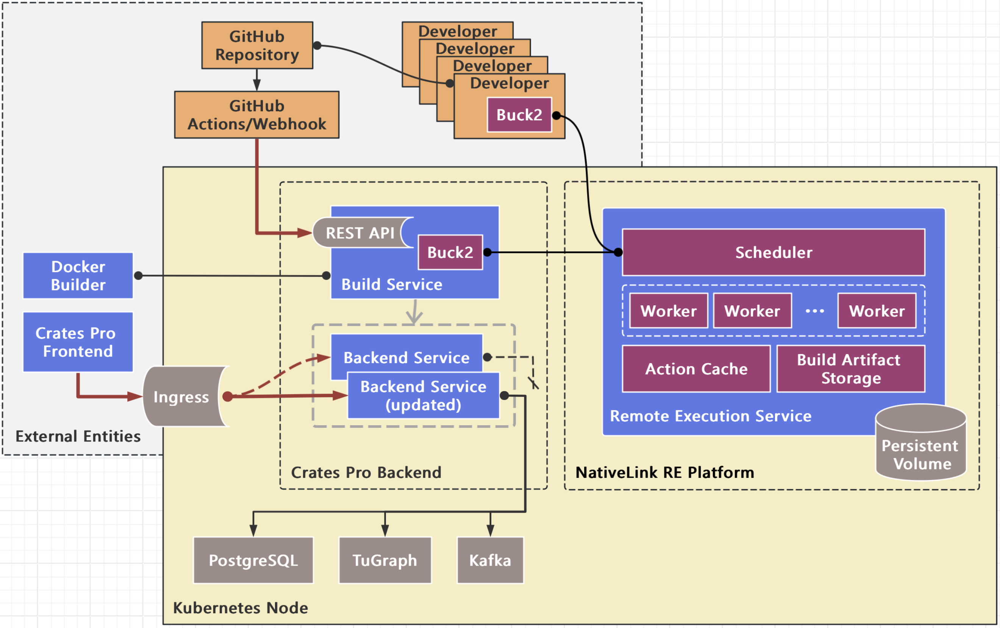

# Crates Pro Infrastructure

This project provides build infrastructure and CI/CD workflow for Crates Pro and all its integrated modules.

## Project Goals

The goals of `crates-pro/crates-pro-infra` are:

1. **Build Infrastructure**: Provide a unified build system for Crates Pro developers, ensuring consistent build results across all development environments.
2. **CI Workflow**: Automate testing for pull requests across all Crates Pro repositories, triggered by PRs in the respective repositories.
3. **CD Workflow**: Automate the deployment process of Crates Pro backend, including rolling updates and rollback capabilities, triggered by merged PRs across all Crates Pro repositories.

## Build Infrastructure

### Why you need it

We use the "Buck2 build system + NativeLink Remote Execution platform" combination to build Crates Pro and its integrated modules. This setup allows developers to build their code without manually installing dependencies or even a Rust toolchain. This setup also ensures build result consistency by using identical dependencies and toolchains across all development environments and the final deployment environment.

### How to use it

**Step 1**: Install Buck2

To start building your code with Buck2, follow the [Buck2 Manual](https://buck2.build/docs/about/getting_started/#installing-buck2) for installation instructions.

**Step 2**: Connect to NativeLink

- Clone this repository
- Edit the `.buckconfig` file in the repository root
- Replace "action_cache_address", "engine_address" and "cas_address" values with the address of the deployed NativeLink service.

Note: Our NativeLink deployment is currently for insider use only. You may need to deploy your own NativeLink service. Refer to the [Remote Execution](remote_execution/README.md) for deployment instructions.

**Step 3**: Build your code

You can now build your code with the `buck2` command or by running `./build.sh`. This script calls the `buck2` command for all executable/shared library targets and copies the build artifacts to the `./build` directory.

### How are third-party dependencies managed

Third-party dependencies are managed in the `third-party` directory. We use `Cargo.toml` to list all required crates.io dependencies and [Reindeer](https://github.com/facebookincubator/reindeer) to generate Buck2 build rules. This allows you to reference dependencies using `//third-party:<package name>` in your build rules. For detailed instructions on adding dependencies and resolving build issues, refer to [Third-party Dependencies](third-party/README.md).

## CI/CD Workflow

### Why you need it

If a module you maintain is integrated into Crates Pro, integrating the Crates Pro CI/CD workflow into your repository ensures:

- Your code still compiles after others merge new PRs into Crates Pro and their modules.
- Your changes won't break others' build configurations when you merge new PRs into your module.
- You quickly see the effects of your PRs in the newly deployed Crates Pro.

### How to set up a CI/CD workflow

(Instructions to be available soon)

## Module View

The following diagram describes how the build infrastructure and the CI/CD workflow are deployed:

### Key Components

- **Developer**: A developer of Crates Pro or its integrated modules, equipped with Buck2
- **GitHub Repository**: The GitHub repository of Crates Pro or its integrated modules
- **GitHub Actions/Webhook**: The entry point of the CI/CD workflow
- **Build Service**: A service in the Crates Pro deployment that pulls the latest code, rebuild changed components, and create a Docker image with build artifacts
- **Remote Execution Service**: A system that receives build requests from Buck2 clients, distributes build actions among workers, and returns the build artifacts to Buck2
- **Backend Service**/**Backend Service (updated)**: The Crates Pro backend, providing service for the frontend through Kubernetes Ingress
- **Crates Pro Frontend**: The [Crates Pro frontend](https://github.com/crates-pro/cratespro-frontend), a web frontend for Crates Pro
- **Docker Builder**: Docker on the host machine, which produces Docker images by running `docker build`

### Workflows

1. **CI Workflow (for a pull request)**:
   - GitHub Actions triggers "build & test" workflow through REST API
   - Build Service builds the changes and create a Docker image
   - Image is configured with test executables as entrypoint
   - Image is deployed to run tests
   - Test results determine whether the PR is ready to be merged
2. **CD Workflow (for a merged PR)**:
   - GitHub Webhook triggers "build & deploy" workflow through REST API
   - Build Service builds the changes and create a Docker image
   - Image is configured with the actual backend as entrypoint
   - Kubernetes performs a rolling update, replacing the existing Crates Pro backend containers with new ones using the updated image

## License

`crates-pro/crates-pro-infra` is dual-licensed under:

- Apache License, Version 2.0, ([LICENSE-APACHE](LICENSE-APACHE) or http://www.apache.org/licenses/LICENSE-2.0)
- MIT license ([LICENSE-MIT](LICENSE-MIT) or http://opensource.org/licenses/MIT)

This project includes the following modules with their respective licenses:

- `crates-pro/crates-pro`: Dual-licensed under Apache-2.0 and MIT
- `crates-pro/performance-benchmark`: Dual-licensed under Apache-2.0 and MIT
- `crates-pro/sensleak-rs`: Licensed under MIT

Please note that while this project itself is dual-licensed, its modules may have different licensing terms. Make sure to comply with the license terms of each module when using or distributing this project.
